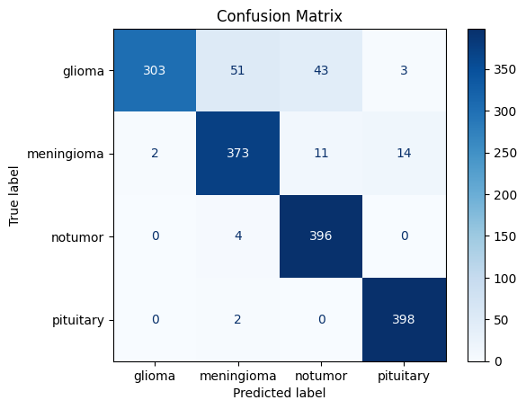
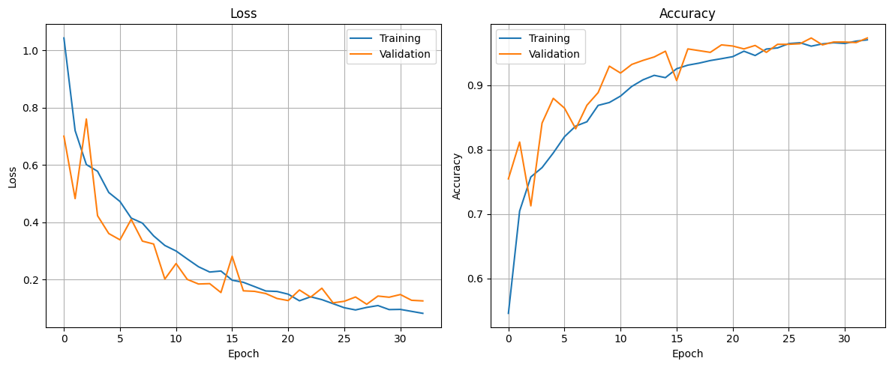
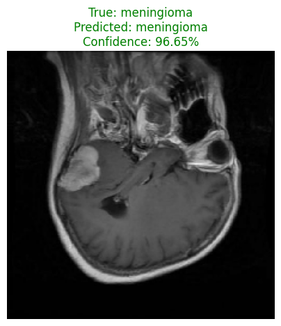

# 🧠 Brain Tumor MRI Classification (CNN)

A deep learning project that classifies brain MRI scans into four categories using a Convolutional Neural Network (CNN) built with TensorFlow/Keras: **Glioma**, **Meningioma**, **Pituitary Tumor**, and **No Tumor**.

🤗 **Pretrained model available on Hugging Face:** [Ahmed-Tarek0/Brain-Tumor-MRI-CNN](https://huggingface.co/Ahmed-Tarek0/Brain-Tumor-MRI-CNN)

---

## 📌 Project Overview

Brain tumors are among the most critical conditions to diagnose early, and MRI scans are a key diagnostic tool. This project builds an end-to-end image classification pipeline that automatically detects and classifies brain tumor types from MRI images, aiming to support faster and more consistent preliminary screening.

The model was trained from scratch (no transfer learning) on the **Brain Tumor MRI Dataset** and achieved **92% accuracy** on the held-out test set.

---

## 📊 Dataset

- **Source:** [Brain Tumor MRI Dataset](https://www.kaggle.com/datasets/masoudnickparvar/brain-tumor-mri-dataset) (Kaggle)
- **Classes (4):** `glioma`, `meningioma`, `notumor`, `pituitary`
- **Split:**
  - Training set → further split 80% training / 20% validation
  - Separate Testing set → 1,600 images (400 per class) used for final evaluation
- **Image size:** 224 × 224 (RGB)
- **Batch size:** 32

---

## 🏗️ Model Architecture

A custom CNN built with `tf.keras.Sequential`:

| Layer | Details |
|---|---|
| Data Augmentation | Random Horizontal Flip, Random Zoom (0.1), Random Rotation (0.1) |
| Rescaling | Pixel values normalized to `[0, 1]` |
| Conv Block 1 | Conv2D(32, 3×3, ReLU) → MaxPooling2D |
| Conv Block 2 | Conv2D(64, 3×3, ReLU) → MaxPooling2D |
| Conv Block 3 | Conv2D(128, 3×3, ReLU) → MaxPooling2D |
| Conv Block 4 | Conv2D(256, 3×3, ReLU) → MaxPooling2D |
| Flatten | — |
| Dense | Dense(256, ReLU) → Dropout(0.5) |
| Output | Dense(4, Softmax) |

**Training configuration:**
- Optimizer: `Adam`
- Loss: `Sparse Categorical Crossentropy`
- Epochs: up to 50, with `EarlyStopping` (patience = 5, restores best weights based on validation loss)
- Data pipeline optimized with `cache()`, `shuffle()`, and `prefetch(AUTOTUNE)`

---

## 📈 Results

**Test Accuracy: 92%**

| Class | Precision | Recall | F1-score |
|---|---|---|---|
| Glioma | 0.99 | 0.76 | 0.86 |
| Meningioma | 0.87 | 0.93 | 0.90 |
| No Tumor | 0.88 | 0.99 | 0.93 |
| Pituitary | 0.96 | 0.99 | 0.98 |
| **Accuracy** | | | **0.92** |
| Macro avg | 0.92 | 0.92 | 0.92 |
| Weighted avg | 0.92 | 0.92 | 0.92 |

### Confusion Matrix


### Training / Validation Loss & Accuracy Curves


### Sample Prediction


---

## 🚀 How to Use the Model

The trained model is hosted on Hugging Face and can be loaded directly:

```python
from huggingface_hub import hf_hub_download
import tensorflow as tf
import numpy as np

# Download the model file from Hugging Face
model_path = hf_hub_download(
    repo_id="Ahmed-Tarek0/Brain-Tumor-MRI-CNN",
    filename="Brain_Tumor_MRI.keras"
)

model = tf.keras.models.load_model(model_path)

class_names = ['glioma', 'meningioma', 'notumor', 'pituitary']

# Load and preprocess an MRI image
img = tf.keras.utils.load_img("path/to/mri_image.jpg", target_size=(224, 224))
img_arr = tf.keras.utils.img_to_array(img)
img_arr = np.expand_dims(img_arr, axis=0)

# Predict
prediction = model.predict(img_arr)
predicted_class = class_names[np.argmax(prediction)]
confidence = np.max(prediction) * 100

print(f"Predicted: {predicted_class} ({confidence:.2f}% confidence)")
```

---

## 🛠️ Tech Stack

- Python
- TensorFlow / Keras
- NumPy
- Matplotlib
- scikit-learn (evaluation metrics)
- KaggleHub (dataset download)

---

> 📁 **Note:** This project lives inside the [`Deep-Learning-Implementations`](https://github.com/Ahmed-Tarek0/Deep-Learning-Implementations) repository, under `02-CNN/Brain_Tumor_MRI/`, as part of a broader collection of deep learning implementations.

## 📂 Repository Structure

```
Deep-Learning-Implementations/
└── 02-CNN/
    └── Brain_Tumor_MRI/
        ├── brain_tumor_cnn.ipynb   # Full notebook: data loading, model building, training, evaluation
        ├── images/
        │   ├── confusion_matrix.png
        │   ├── loss_accuracy_curve.png
        │   └── predicted_sample.png
        └── README.md
```

---

## 🔗 Links

- 📁 This project's folder: [Deep-Learning-Implementations/02-CNN/Brain_Tumor_MRI](https://github.com/Ahmed-Tarek0/Deep-Learning-Implementations/tree/main/02-CNN/Brain_Tumor_MRI)
- 🤗 Model on Hugging Face: [Ahmed-Tarek0/Brain-Tumor-MRI-CNN](https://huggingface.co/Ahmed-Tarek0/Brain-Tumor-MRI-CNN)
- 📊 Dataset: [Brain Tumor MRI Dataset (Kaggle)](https://www.kaggle.com/datasets/masoudnickparvar/brain-tumor-mri-dataset)

---

## 👤 Author

**Ahmed Tarek**
GitHub: [@Ahmed-Tarek0](https://github.com/Ahmed-Tarek0)

---

## ⚠️ Disclaimer

This project is for educational and portfolio purposes only. It is **not** intended for real medical diagnosis or clinical use.